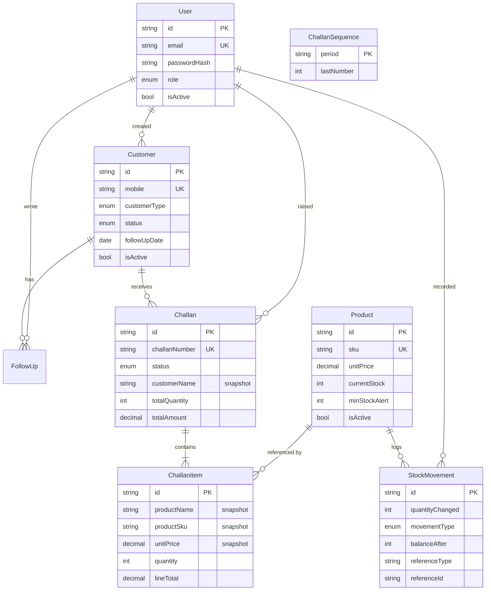

# Architecture

A short tour of how the system is put together and why the significant decisions
were made that way.

---

## Shape of the system

```
Browser
  │
  │  HTTPS, JSON, Bearer token
  ▼
React SPA (Vercel)          ── static files, no server-side rendering
  │
  │  /api/*
  ▼
Express API (Render)        ── validation, authentication, authorisation,
  │                            business rules, transactions
  ▼
PostgreSQL (Neon)           ── the single source of truth, including the
                               constraints that make the rules unbreakable
```

In development the Vite dev server proxies `/api/*` to the backend on port 4000,
so the frontend and API share an origin and CORS never enters the picture. In
production the frontend calls the Render origin directly and the API allows it
by an explicit origin allowlist.

---

## Backend layering

```
src/
├── config/       env validation, Prisma client
├── middleware/   authenticate, authorize, validate, rate limiting, error handler
├── modules/      one folder per domain: auth, customers, products, stock, challans
│   └── <domain>/ schema.ts → routes.ts → controller.ts → service.ts
├── routes/       mounts every module under /api
├── utils/        AppError, response envelope, asyncHandler, shared query schemas
├── app.ts        assembles the Express app
└── server.ts     connects the database, listens, shuts down gracefully
```

Each module is four files with one job each:

| File | Responsibility |
|---|---|
| `*.schema.ts` | Zod shapes for body, query and params. The only place input rules live. |
| `*.routes.ts` | Which HTTP verb, which middleware, which roles. Readable as a permission table. |
| `*.controller.ts` | Unwraps the request, calls the service, formats the response. No business logic. |
| `*.service.ts` | The actual rules and all database access. Knows nothing about HTTP. |

Keeping services free of HTTP types is what lets the challan module call the
stock module's `applyStockMovement` directly, inside its own transaction,
without any of the two knowing about requests or responses.

---

## Request lifecycle

A `POST /api/challans/:id/confirm` travels through:

1. **helmet** — security headers
2. **cors** — origin checked against the allowlist
3. **express.json** — body parsed, 1 MB limit
4. **globalRateLimiter** — per-IP ceiling
5. **authenticate** — bearer token verified, then the user re-read from the
   database and attached to `req.user`
6. **authorize('ADMIN','SALES','WAREHOUSE')** — role checked
7. **validate({ params })** — Zod parses and replaces the request parts
8. **controller** — calls the service
9. **service** — opens a transaction and applies the business rules
10. **response envelope** — `{ success, data, meta?, message? }`

Anything thrown anywhere in that chain lands in the global error handler, which
maps `AppError`, `ZodError` and Prisma error codes onto the right HTTP status.
Nothing else can escape as a raw 500 with a stack trace.

---

## Data model



---

## The decisions that matter

### Challan items store a snapshot, not just a foreign key

`ChallanItem` copies the product's name, SKU, category and unit price at the
moment the challan is raised. `Challan` does the same for the customer.

A challan is a dispatch document: what left the warehouse, at what price, on
what day. If it held only `productId`, then renaming a product or changing its
price next month would silently rewrite every historical challan — and every
invoice built from one. The smoke suite renames *and* reprices a product after
dispatch and asserts the challan is unchanged.

### Stock can only move through one function

`applyStockMovement` is the single point at which `Product.currentStock` ever
changes. The manual adjustment endpoint uses it; challan confirmation and
cancellation use it, inside their own transactions. There is no code path that
changes stock without writing a `StockMovement`, or writes a movement without
changing stock — so the ledger and the stock level cannot disagree.

`currentStock` is deliberately absent from the product update schema. Even a
new product's opening stock is applied as an IN movement rather than written
into the column, so the very first balance a product has is explained by a row
in the ledger.

### Stock cannot go negative, and it is the database that guarantees it

The decrement carries its own precondition:

```sql
UPDATE products
   SET "currentStock" = "currentStock" - $1
 WHERE id = $2 AND "isActive" = true AND "currentStock" >= $1
RETURNING id, name, sku, "currentStock", "minStockAlert"
```

Zero rows affected means there was not enough, and that becomes a 400 carrying
the product, the amount requested, the amount available and the shortfall.

The obvious implementation — read the stock, check it in JavaScript, then write
— is a race. Two concurrent requests both read "50 available", both pass the
check, and both dispatch 40. Here the second `UPDATE` simply matches no rows.

Two tests exercise this directly: ten simultaneous withdrawals of 20 units
against a balance of 120 (exactly six succeed, four are rejected, the balance
lands on zero), and five simultaneous challan confirmations for two units each
against a stock of five (exactly two confirm).

`RETURNING` also collapses the guard, the write and the read-back into one
round trip. An earlier version used four, and under concurrency later
transactions queued behind the row lock long enough to exceed Prisma's default
transaction timeout — so requests that should have been cleanly accepted or
cleanly rejected errored instead. Stock never went negative, but the outcomes
were wrong.

### Confirmation is all-or-nothing

Confirming a challan runs in one transaction: gather every shortfall, deduct
each line, write the OUT movements, flip the status. If any line is short,
nothing is deducted — not even the lines that had stock. A half-dispatched
challan is not a state the system can reach.

Shortfalls are collected for all lines before any is applied, so a ten-line
challan reports every problem at once instead of forcing ten retries.

### Challan numbers come from a counter table

`ChallanSequence` holds one row per month and is incremented inside the same
transaction that creates the challan. `count() + 1` is a race: two simultaneous
requests count the same total and both build `CH-202609-0007`. The smoke suite
asserts every number issued is distinct.

### Deletes are soft

Customers and products are referenced by challans and by the stock ledger.
Destroying a row would either fail on the foreign key or orphan real business
documents, so `isActive` is flipped instead. The record disappears from default
lists and every historical document still reads correctly.

### Money is `Decimal(12,2)`

Never `Float`. Floating point silently corrupts totals; a wholesale system that
cannot add up is worthless. Values cross the API as strings to avoid JavaScript
number precision on the way out, and the frontend formats them for display.

### The authenticated user is re-read on every request

The JWT carries the user id and role, but `authenticate` still loads the user
from the database. That is one indexed primary-key lookup per request, and it
buys immediate effect: deactivating an employee cuts their access on their very
next request rather than whenever their seven-day token happens to expire.

### Neon's direct endpoint, not the pooled one

The pooled endpoint runs PgBouncer in transaction mode, which cannot run
migrations and is a poor fit for an interactive transaction that holds row
locks across several statements — exactly what challan confirmation does. The
backend is a single long-lived instance, so it does not need the pooler.

---

## Frontend structure

```
src/
├── api/          axios instance, interceptors, typed endpoint functions
├── components/   ui primitives, the app shell
├── context/      AuthContext
├── features/     per-domain forms and modals
├── hooks/        useDebounced
├── pages/        one component per route
├── routes/       router and the auth guard
└── types/        API response types
```

- **TanStack Query** owns all server state. Mutations invalidate the query keys
  they affect, so confirming a challan refreshes the product list and the stock
  ledger without any manual wiring.
- **The axios interceptor** attaches the token and turns any 401 that is not a
  login attempt into a logout, so an expired token cannot strand someone in a
  UI where nothing works.
- **The sidebar is filtered by role** so the UI does not offer actions the API
  will refuse. This is presentation only — every route is still enforced
  server-side, and the smoke suite proves it by calling each endpoint as each
  role.
- **`keepPreviousData`** keeps the current page visible while the next loads,
  so tables do not collapse into a spinner on every keystroke.

---

## Testing

There is no unit test suite. Given the time budget, the coverage that earns most
is at the HTTP boundary, so `npm run test:smoke` drives the running API over
real requests — routing, middleware order, validation, authentication,
authorisation, status codes, transactions and concurrency. 135 checks.

`npm run db:verify` asserts the invariants directly against the database:
stock equals the sum of its movements, every recorded balance matches the
running total, no negative stock, challan totals equal their line items,
confirmed challans moved stock and drafts did not, every item carries a
snapshot, and the challan sequence covers every number issued.

Both are runnable against the deployed API and database, not only locally.
